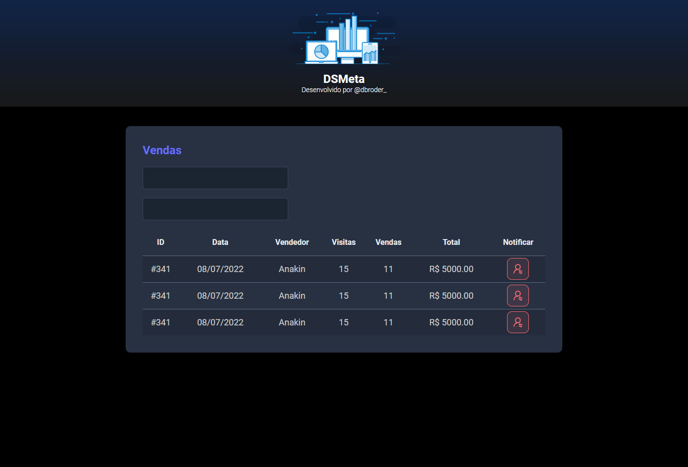

# DSMeta - DevSuperior

Projeto construído das aulas do DevSuperior.

[🔗 Clique aqui para acessar](https://d-broder.github.io/Projeto-DSMeta-DevSuperior-HTML-CSS/)

## 🔧 Tecnologias

-   HTML
-   CSS
-   Git e Github

## 💡 O que pratiquei?

-   Montar o layour básico de um site com diversos recursos.
-   Gerar link para acessar o site.

## 📧 Contato

daniel_sendreti@hotmail.com
